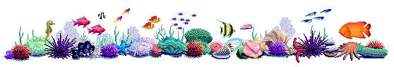

---




```
####_____ ____  _____________       _____    ____  ______
###/ ___// __ \/ ____/_  __/ |     / /   |  / __ \/ ____/
###\__ \/ / / / /_    / /  | | /| / / /| | / /_/ / __/   
##___/ / /_/ / __/   / /   | |/ |/ / ___ |/ _, _/ /___   
#/____/\____/_/     /_/    |__/|__/_/  |_/_/ |_/_____/
```

| ware          | desc           
| ------------- | -------------|
|  [synth8](https://github.com/joshnatis/synth8) | An Arduino-based synthesizer |
|  [phd](https://github.com/joshnatis/phd)      | A Markdown to HTML parser|
|  [winona](https://github.com/joshnatis/winona) | An ncurses-based command-line music player |
|  [acidtab](https://github.com/joshnatis/acidtab) |A tab archiver and manager |
|  [Food Management System](https://github.com/joshnatis/fms) |A food management system with a cool CLI |
|  [teapot](https://github.com/joshnatis/teapot) | A command-line music player|
|  [BigMemeEditor32](https://josh8.com/meme) | A meme editor and deep-fryer  |


See more on my [software](https://josh8.com/software) page, or below :)
